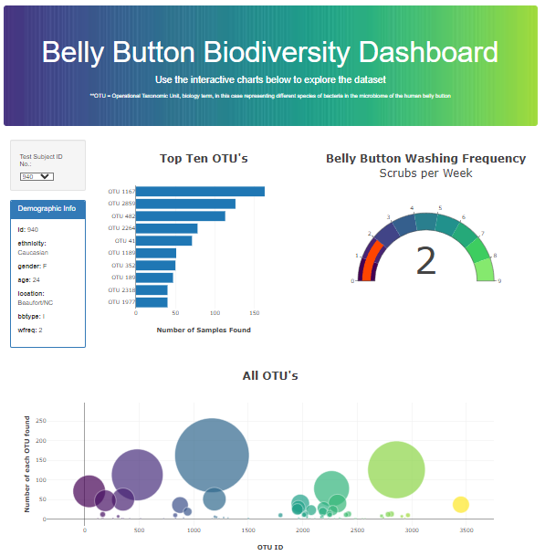
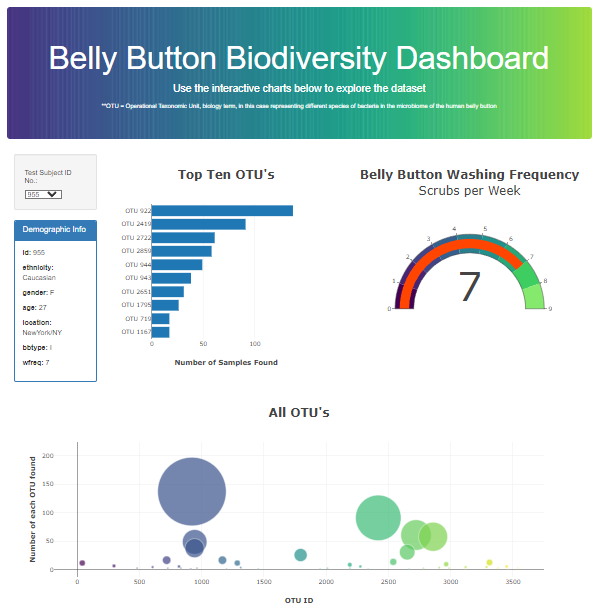

# Belly Button Dashboard with JavaScript and Plotly

Link to webpage: https://johbry17.github.io/Belly-Button-Dashboard/

Development on this project has stopped.

- [Description](#description)
- [Usage](#usage)
- [Sample Gallery](#sample-gallery)
- [References](#references)
- [Acknowledgements](#acknowledgements)
- [Author](#author)

## Description

Builds an interactive dashboard to dynamically explore the [Belly Button Biodiversity dataset](http://robdunnlab.com/projects/belly-button-biodiversity/) that offers a series of visualizations that depict the type of bacteria found in various people's belly buttons. The dataset reveals that a small handful of microbial species (also called operational taxonomic units, or OTUs, in the study) were present in more than 70% of people, while the rest were relatively rare.

## Usage

Use page link [here](https://johbry17.github.io/14-belly-button-biodiversity-plotly-javascript/)). Choose from the dropdown menu to display different results for different test subjects.

## Sample Gallery

Default (subject 940):

Example (subject 955):

## References

Hulcr, J. et al. (2012) A Jungle in There: Bacteria in Belly Buttons are Highly Diverse, but Predictable. Retrieved from: http://robdunnlab.com/projects/belly-button-biodiversity/results-and-data/.

## Acknowledgements

Thanks to Geronimo Perez for feedback and assistance

## Author

Bryan Johns, September, 2023
